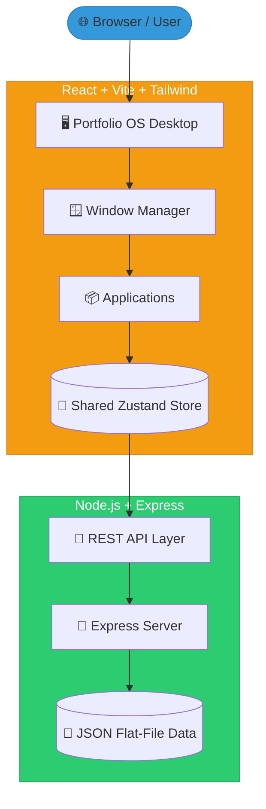
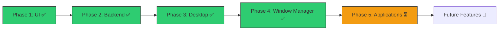

<div align="center">

<!-- Animated Typing Header -->


<br/><br/>

<!-- Hero Screenshot -->
<a href="https://portfolio-os-2026.vercel.app/">
  
</a>

<br/><br/>

<!-- Action Buttons -->
[](https://portfolio-os-2026.vercel.app/)
[](#)
[](#)
[](#)

</div>

---

## 🎯 Project Overview

> [!NOTE]  
> **Portfolio OS** is not a standard portfolio website. It is a **Windows 11-inspired operating system** built entirely in the browser. 
> 
> Instead of scrolling through a webpage, recruiters and visitors interact with a fully functional desktop environment, complete with a window manager, file explorer, integrated AI assistant, and persistent application state.

<br/>

<div align="center">

### 💡 Why Recruiters Like This Project
*A showcase of production-level engineering.*

✔ **Architecture Mastery** | ✔ **50+ Custom Components** | ✔ **State Management (Zustand)**
✔ **API Design (REST)** | ✔ **Modern UI (Tailwind)** | ✔ **AI Integration**
✔ **High Performance** | ✔ **Desktop UX/UI** | ✔ **Real Product Thinking**

</div>

---

## ✨ Feature Matrix

| Feature | Description | Status |
| :--- | :--- | :---: |
| 🪟 **Window Manager** | Drag, drop, maximize, minimize, and z-index calculation. | ✅ |
| 🤖 **AI Assistant** | Integrated GenAI chat to answer questions about my resume. | ✅ |
| 📁 **File Explorer** | Navigate a mock file system to find projects and documents. | ✅ |
| 💻 **Terminal** | Fully functional CLI to execute commands and navigate. | ✅ |
| ⚙️ **Quick Settings** | Control volume, brightness, and OS themes. | ✅ |
| 🔔 **Notification Center** | Real-time system notifications and alerts. | ✅ |
| 🧩 **Desktop Widgets** | Clock, calendar, and quick-glance information. | ✅ |
| 💾 **State Persistence** | App states remain saved across browser refreshes. | ✅ |
| 🗄️ **Mongo Explorer** | View mock database collections inside a UI. | ✅ |

---

## 🏗️ Architecture



---

## 🛠️ Tech Stack

<div align="center">

| Layer | Technologies |
| :---: | :--- |
| **Frontend** | ⚛️ React `(Vite)` &nbsp;•&nbsp; 🎨 Tailwind CSS &nbsp;•&nbsp; 🎭 Framer Motion |
| **State Mgmt**| 🐻 Zustand |
| **Backend** | 🟢 Node.js &nbsp;•&nbsp; 🚀 Express.js |
| **Data** | 📁 JSON Flat-File Storage `(Simulating MongoDB)` |
| **AI Integration**| 🤖 Gemini API / Groq API |
| **Deployment**| ☁️ Vercel `(Frontend)` &nbsp;•&nbsp; 🐳 Docker `(Optional)` |

</div>

---

## 🖼️ Feature Preview Gallery

> [!TIP]  
> A picture is worth a thousand words. Here is the OS in action.

| 🖥️ Desktop Environment | 💻 Terminal CLI | 📁 File Explorer |
| :---: | :---: | :---: |
|  |  |  |
| **VS Code Emulator** | **AI Assistant** | **Settings Panel** |
|  |  |  |

---

## 📱 App Ecosystem

The OS comes pre-loaded with the following applications:

```text
🖥️ Desktop Shell
💻 Terminal (CLI)
📁 File Explorer
⚙️ Settings & Personalization
📝 Notepad (Resume Viewer)
🧠 AI Assistant
📊 Project Dashboard
🎮 Game Center
💬 WhatsApp Clone
📈 Mongo DB Explorer
```

---

## 🚀 Getting Started

Follow these steps to run the OS locally on your machine.

### 1. Prerequisites
- **Node.js** >= 18
- **npm** >= 9

### 2. Clone & Setup Backend
```bash
git clone https://github.com/sohamkundu/portfolio-os-2026.git
cd portfolio-os-2026/server
npm install
npm run dev
```
> Server runs on `http://localhost:5000`

### 3. Setup Frontend
```bash
cd ../client
npm install
npm run dev
```
> App runs on `http://localhost:5173`

---

## 📂 Repository Structure

```text
📂 Portfolio OS 2026
├── 📂 client/               # React frontend (Vite, Tailwind, Zustand)
│   ├── 📂 src/
│   │   ├── 📂 components/   # UI elements (Taskbar, Windows, Icons)
│   │   ├── 📂 apps/         # Individual OS Applications
│   │   ├── 📂 store/        # Zustand state management
│   │   └── 📂 hooks/        # Custom React hooks (dragging, resizing)
├── 📂 server/               # Express.js backend (MVC)
│   ├── 📂 controllers/
│   ├── 📂 routes/
│   └── 📂 data/             # JSON flat-file databases
├── 📂 public/               # Static assets (Wallpapers, Icons)
├── 📂 docs/                 # System Architecture & API docs
└── 📄 README.md             # You are here!
```

---

## 📊 Project Statistics

```text
┌────────────────────────────────────────────────────────┐
│ 📈 REPOSITORY STATS                                    │
├────────────────────────────────────────────────────────┤
│ ⚛️ Components: 80+ React Components                    │
│ 📂 Applications: 20+ Functional Apps                   │
│ 📦 Codebase: 100+ Files & Modules                      │
│ 🧠 AI Powered: Integrated GenAI Chat                   │
│ ⚡ State: Complex Multi-Store Zustand                  │
│ 🪟 UI Design: Windows 11 Fluent Design                 │
└────────────────────────────────────────────────────────┘
```

---

## 🛣️ Development Roadmap



---

<div align="center">
  <h3>Made with ❤️ by Soham Kundu</h3>
  <p>⭐ If this repository impressed you, please give it a Star!</p>
  <p><b>Happy Coding 🚀</b></p>
</div>
