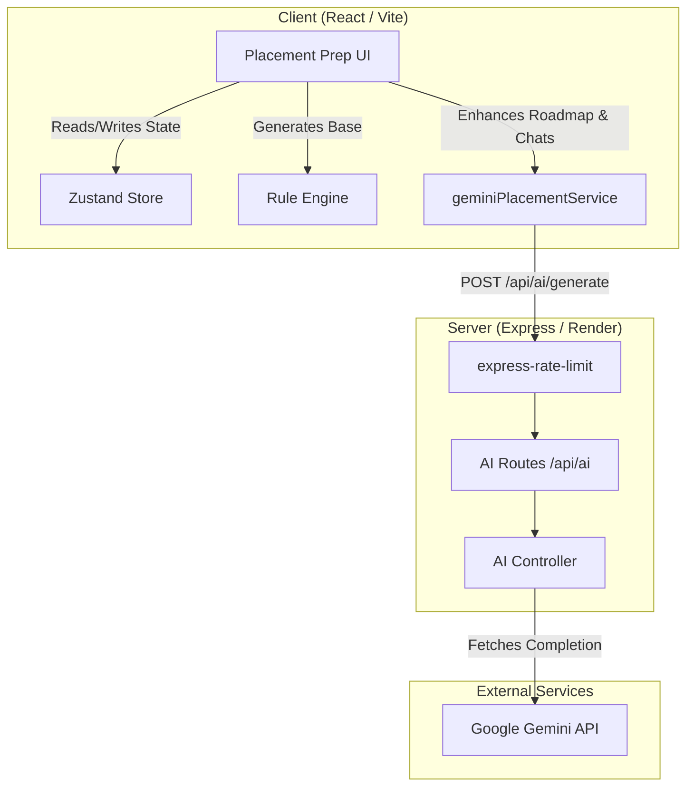

# Placement Preparation App — System Architecture & Documentation

## Overview
The **Placement Preparation App** is a specialized module within the Portfolio OS designed to help CS students systematically prepare for software engineering placements (TCS, Infosys, Wipro, Accenture, and Product Companies). It provides dynamically generated roadmaps, progress tracking, and an interactive AI Study Coach.

## Features
- **Dynamic Roadmap Generation:** Generates a structured, day-wise preparation plan based on the user's timeline (e.g., 30, 60, 90 days), target company type, and focus mode.
- **AI-Enhanced Study Plan:** Uses Google Gemini AI to enrich the base roadmap with specific sub-concepts, revision days, and 3-5 typical interview questions per task.
- **Context-Aware AI Study Coach:** A conversational AI mentor that understands the user's current phase and weak topics, offering encouraging and highly technical explanations.
- **Progress & Mastery Tracking:** Tracks completion of topics and calculates DSA pattern mastery over time.
- **Secure Backend Integration:** API requests to Gemini are proxied securely through the backend, protected by `express-rate-limit` to prevent abuse.

## How to Access
1. **Boot up Portfolio OS:** Visit the deployed Vercel frontend.
2. **Open the App:** Navigate to the Desktop or Start Menu and click on the **Placement Prep** icon.
3. **Configure Settings:** Go to the Settings tab to input your target companies, duration, and weak topics.
4. **Generate Roadmap:** Click "Regenerate Roadmap" to let the AI build your customized journey.
5. **Ask the Coach:** Open the AI Study Coach tab and ask specific DSA or interview-related questions.

## System Architecture Diagram

## Journey: From Scratch to End

Here is the technical lifecycle of what was implemented to bring this app to life:

1. **State Management (Frontend):** 
   - Created `usePlacementStore` to hold user preferences (duration, focus mode), progress (completed topics, weak areas), and the active roadmap.
2. **Rule Engine:** 
   - Developed a deterministic `RuleEngine` that creates a basic skeletal structure for the roadmap based on the user's timeline and goals.
3. **AI Service Client:** 
   - Built `geminiPlacementService.js` to communicate with the backend. 
   - Implemented intelligent routing to automatically format the `VITE_API_URL` and fall back to localhost in development.
   - Added a robust **503 Retry Mechanism** (3 attempts) to silently recover from temporary AI unavailability.
4. **Backend AI Controller:** 
   - Created `aiController.js` on the Express server to securely proxy requests to the Google Gemini API, keeping the API key hidden from the browser.
   - Optimized `maxOutputTokens` to 2048 to improve latency and lower costs.
   - Passed raw error text from Gemini back to the client to assist with debugging.
5. **System Prompt Engineering:** 
   - Designed distinct prompts for the Roadmap generator (enforcing structured JSON arrays, revision days, and coding question counts) and the Study Coach (instructed to act as an expert DSA mentor focusing on specific companies).
6. **Rate Limiting:** 
   - Integrated `express-rate-limit` specifically on the `/api/ai/generate` endpoint, capping requests to 50 per 15 minutes to protect against API key abuse.
7. **UI Polish & Loading States:** 
   - Added sophisticated loading indicators, including an orbital spinner and "Thinking... Analyzing..." texts to improve perceived performance during AI generation.
